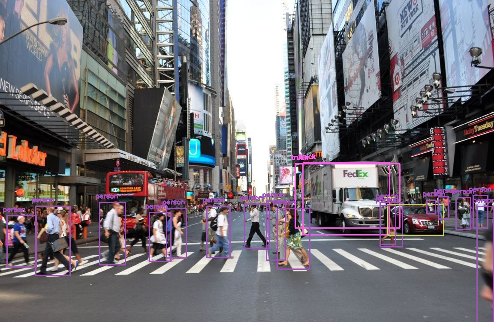

###### YOLO implementation using opencv

`pip3 install opencv-python numpy `

Get the weights file by by running wget in the working directory

`wget https://pjreddie.com/media/files/yolov3.weights`

Running the yolo:

`python3 yolo.py --image busystreet.jpg --config yolov3.cfg --weights yolov3.weights --classes yolov3_classes.txt
`

Sample output:  

